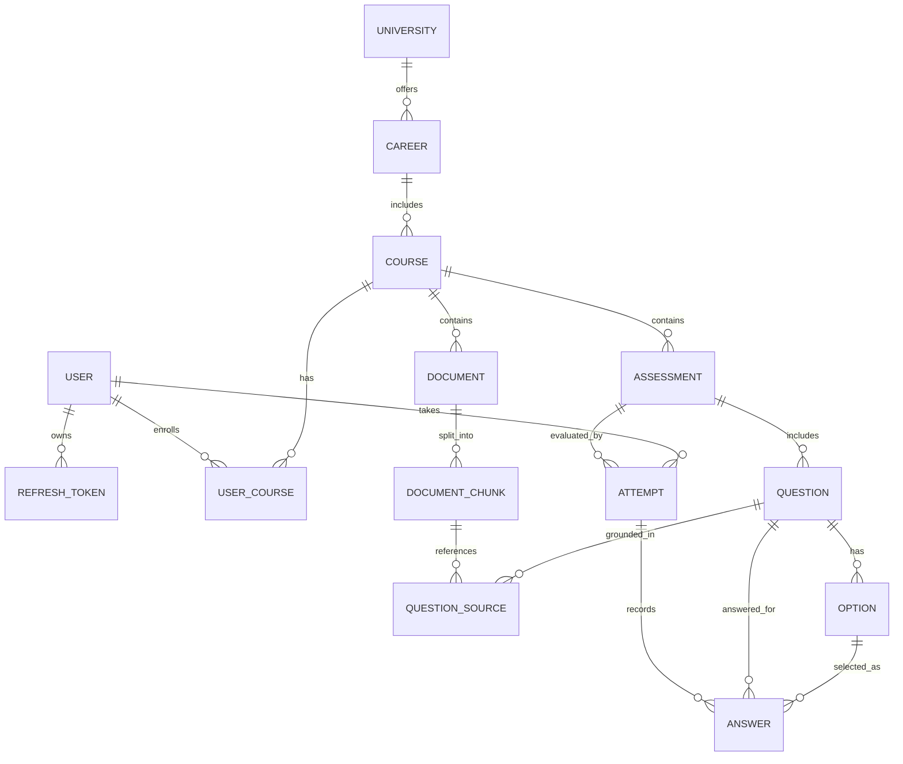

# ExamForge: Generador Inteligente de Evaluaciones Académicas mediante RAG

## Portada
- **Título del Proyecto:** ExamForge - Plataforma Backend para la Generación, Gestión y Resolución de Evaluaciones Académicas Contextualizadas mediante Arquitectura RAG
- **Curso:** CS 2031 Desarrollo Basado en Plataforma
- **Periodo Académico:** 2026-2
- **Integrantes del Equipo:**
    * Lucia Rodriguez — Código: 202310459
    * Samira Rincon — Código: 202220436
    * Valeria Briceño — Código: 202310513
- **Enlace de Despliegue en Producción:** `[En despliegue - Planificado Semana 7]`- **Colección Postman:** `[Colección en construcción - Se publicará con los endpoints finales en la raíz del repositorio]`

---

## Índice
1. [Introducción](#introducción)
    - [Contexto](#contexto)
    - [Objetivos del Proyecto](#objetivos-del-proyecto)
2. [Identificación del Problema o Necesidad](#identificación-del-problema-o-necesidad)
    - [Descripción del Problema](#descripción-del-problema)
    - [Justificación](#justificación)
3. [Descripción de la Solución](#descripción-de-la-solución)
    - [Funcionalidades Implementadas](#funcionalidades-implementadas)
    - [Tecnologías Utilizadas](#tecnologías-utilizadas)
4. [Modelo de Entidades](#modelo-de-entidades)
    - [Diagrama Entidad-Relación](#diagrama-entidad-relación)
    - [Descripción de Entidades, Atributos y Relaciones JPA](#descripción-de-entidades-atributos-y-relaciones-jpa)
5. [Manejo de Errores](#manejo-de-errores)
    - [Estrategia de Excepciones Globales](#estrategia-de-excepciones-globales)
    - [Catálogo de Excepciones Personalizadas](#catálogo-de-excepciones-personalizadas)
6. [Medidas de Seguridad Implementadas](#medidas-de-seguridad-implementadas)
    - [Seguridad de Datos y Arquitectura JWT](#seguridad-de-datos-y-arquitectura-jwt)
    - [Control de Acceso Basado en Roles (RBAC)](#control-de-acceso-basado-en-roles-rbac)
    - [Prevención de Vulnerabilidades Comunes](#prevención-de-vulnerabilidades-comunes)
7. [Eventos y Asincronía](#eventos-y-asincronía)
    - [Pipeline Asíncrono de Procesamiento y Vectorización](#pipeline-asíncrono-de-procesamiento-y-vectorización)
    - [Notificaciones y Procesamiento en Segundo Plano](#notificaciones-y-procesamiento-en-segundo-plano)
8. [GitHub & Management](#github--management)
    - [Gestión de Tareas y Flujo Git](#gestión-de-tareas-y-flujo-git)
    - [Integración Continua con GitHub Actions](#integración-continua-con-github-actions)
9. [Instrucciones de Instalación y Ejecución Local](#instrucciones-de-instalación-y-ejecución-local)

---

## Introducción

### Contexto
En el ecosistema universitario contemporáneo, el aprendizaje autónomo y la preparación para evaluaciones constituyen actividades críticas que demandan gran cantidad de tiempo de estudiantes y docentes. Los materiales didácticos (diapositivas, sílabos, lecturas complementarias y guías) suelen dispersarse en plataformas heterogéneas. Aunque los modelos de lenguaje masivos (LLMs) permiten formular preguntas automáticamente, carecen de un marco estructurado que asocie el conocimiento generado con una jerarquía académica formal (universidad, carrera y curso), imposibilitando la verificación documental y el seguimiento del rendimiento estudiantil. ExamForge surge como una plataforma backend construida con estándares de ingeniería de software que centraliza, procesa y evalúa el conocimiento institucional mediante arquitecturas de recuperación de información aumentada por generación (RAG).

### Objetivos del Proyecto
* Diseñar e implementar una API RESTful escalable y modular con Spring Boot que gestione la jerarquía curricular y el flujo completo de creación, edición y resolución de exámenes.
* Desarrollar un pipeline asíncrono y desacoplado para la ingesta de documentos PDF, su fragmentación semántica (*chunking*) y la generación de *embeddings* vectoriales indexados.
* Implementar un sistema de seguridad sin estado basado en JSON Web Tokens (JWT) y autorización basada en roles (RBAC) para proteger los recursos académicos.
* Asegurar trazabilidad estricta entre las preguntas de evaluación generadas y los fragmentos textuales de sustento mediante relaciones explícitas y métricas de relevancia semántica.

---

## Identificación del Problema o Necesidad

### Descripción del Problema
Los estudiantes universitarios enfrentan dificultades para medir su nivel de dominio conceptual antes de sus evaluaciones oficiales:
* **Falta de Trazabilidad:** Las herramientas de IA generalistas generan reactivos conceptualmente plausibles pero desalineados de la bibliografía oficial, sin citar el texto ni la página de sustento.
* **Desorganización Curricular:** No existe un modelo relacional que vincule las evaluaciones a la malla formal (universidad, carrera, asignatura).
* **Ausencia de un Motor de Práctica Interactiva:** Las evaluaciones no se integran a un sistema de intentos que registre respuestas por alternativa, impidiendo medir el desempeño analítico por tema.

### Justificación
ExamForge resuelve estas deficiencias al centralizar el material del curso en una base vectorial normalizada. Al anclar la generación evaluativa a fragmentos documentales específicos, se garantiza que la práctica sea fidedigna, se optimiza el tiempo docente en el armado de bancos de preguntas y se dota al alumno de retroalimentación formativa inmediata sobre sus puntos débiles.

---

## Descripción de la Solución

### Funcionalidades Implementadas
* **Gestión de Identidad y Sesión:** Registro de usuarios, encriptación de credenciales con BCrypt, emisión de tokens de acceso JWT y ciclo de vida de sesiones con persistencia de refresh tokens.
* **Estructuración Académica Curricular:** Mantenimiento de universidades, carreras, cursos y matrículas diferenciadas por roles.
* **Ingesta, Fragmentación y Vectorización:** Subida de material académico en PDF, partición en bloques de texto (*chunks*) y cálculo de vectores semánticos almacenados mediante `pgvector`.
* **Generación Paramétrica de Evaluaciones (RAG):** Recuperación de contexto por similitud coseno y síntesis automatizada de reactivos con justificación conceptual y cita de origen.
* **Motor de Resolución y Métricas:** Registro puntual de cada respuesta seleccionada (`Answer`), calificación automática y consolidación de desempeño por tema y dificultad.
* **Procesamiento y Notificaciones Asíncronas:** Delegación a segundo plano de la lectura pesada de archivos, la generación del examen y el envío telemático de reportes de resultados vía correo electrónico.

### Tecnologías Utilizadas
* **Lenguaje:** Java 21 LTS
* **Framework Principal:** Spring Boot 3.5.5 (Spring Web, Spring Data JPA, Spring Security, Spring Mail, Validation)
* **Base de Datos:** PostgreSQL 16 con extensión vectorial `pgvector`
* **Inteligencia Artificial y Embeddings:** Integración con API de LLMs (OpenAI / Gemini) y modelos de incrustación vectorial (*text-embedding-3-small* / *text-embedding-004*)
* **Seguridad y Criptografía:** Spring Security 6, JJWT (Java JWT) y BCrypt
* **Procesamiento Documental:** Apache PDFBox
* **Mapeo y Utilidades:** Lombok y MapStruct
* **Servicio de Mensajería:** JavaMailSender con plantillas dinámicas en Thymeleaf
* **Gestión de Dependencias y Construcción:** Apache Maven
* **Control de Versiones:** Git, GitHub Projects y GitFlow adaptado

---

## Modelo de Entidades

### Diagrama Entidad-Relación


---
## Descripción de Entidades, Atributos y Relaciones JPA
El modelo comprende 15 entidades normalizadas para soportar la jerarquía académica y la recuperación aumentada:

1. University (universities): Institución académica de procedencia (id, name, acronym). Relación @OneToMany hacia Career.
2. Career (careers): Programa profesional universitario (id, name, code). Relación @ManyToOne hacia University y @OneToMany hacia Course.
3. Course (courses): Asignatura académica (id, name, code, description). Relación @ManyToOne hacia Career y @OneToMany hacia UserCourse, Document y Assessment.
4. User (users): Cuentas de usuario del sistema (id, fullName, email, password, role, createdAt). Relación @OneToMany hacia UserCourse, Attempt y RefreshToken.
5. RefreshToken (refresh_tokens): Persistencia de tokens de refresco revocables para renovación de sesión sin estado (id, token, expiryDate, revoked). Relación @ManyToOne hacia User.
6. UserCourse (user_courses): Enlace de matrícula institucional (id, roleInCourse, enrolledAt). Relación @ManyToOne hacia User y Course.
7. Document (documents): Archivo bibliográfico cargado (id, title, fileUrl, fileSize, status, createdAt). Relación @ManyToOne hacia Course y User, y @OneToMany en cascada hacia DocumentChunk.
8. DocumentChunk (document_chunks): Fragmento textual procesado (id, content, pageNumber, chunkOrder, embedding). El campo embedding mapea el vector semántico (tipo vector en PostgreSQL). Relación @ManyToOne hacia Document y @OneToMany hacia QuestionSource.
9. QuestionSource (question_sources): Entidad de trazabilidad que almacena la justificación documental y el puntaje de similitud entre la pregunta y el fragmento bibliográfico (id, relevanceScore, excerptCited). Relación @ManyToOne hacia Question y DocumentChunk.
10. Assessment (assessments): Evaluación generada (id, title, description, difficulty, isPublic, status). Relación @ManyToOne hacia Course y User, y @OneToMany hacia Question e Attempt.
11. Question (questions): Reactivo conceptual (id, text, type, explanation). Relación @ManyToOne hacia Assessment, y @OneToMany hacia Option, QuestionSource y Answer.
12. Option (options): Alternativas de respuesta (id, text, isCorrect). Relación @ManyToOne hacia Question.
13. Attempt (attempts): Sesión evaluativa ejecutada por un estudiante (id, score, startedAt, completedAt, feedback). Relación @ManyToOne hacia Assessment y User, y @OneToMany hacia Answer.
14. Answer (answers): Registro de la respuesta emitida por el alumno en una pregunta específica de un intento (id, isCorrect). Relación @ManyToOne hacia Attempt, Question y Option (opción marcada).

---

## Manejo de Errores
### Estrategia de Excepciones Globales
La interceptación centralizada de errores se gestiona a través de un @RestControllerAdvice, garantizando que cualquier anomalía interna se transforme en una respuesta HTTP normalizada mediante ErrorResponseDTO:

- **timestamp**: Fecha y hora del incidente en formato ISO-8601.

- **status**: Código numérico HTTP devuelto.

- **error**: Denominación estándar del estado HTTP.

- **message**: Mensaje descriptivo con el motivo puntual del fallo.

- **path**: URI del recurso invocado.

### Catálogo de Excepciones Personalizadas
Se implementó una jerarquía basada en una clase abstracta común ApiException que hereda de RuntimeException. Todas las excepciones de negocio derivan de ella:

```
ApiException (abstracta)
├── ResourceNotFoundException (HTTP 404)
├── BadRequestException (HTTP 400)
├── UnauthorizedException (HTTP 401)
├── InvalidTokenException (HTTP 401)
├── ForbiddenException (HTTP 403)
├── DuplicateResourceException (HTTP 409)
├── AttemptAlreadySubmittedException (HTTP 409)
└── FileStorageException (HTTP 500)
```

Adicionalmente, se maneja de forma controlada la excepción de infraestructura MethodArgumentNotValidException (HTTP 400), la cual desglosa los errores de validación declarativa @Valid en un mapa estructurado de campo y causa.

## Medidas de Seguridad Implementadas
### Seguridad de Datos y Arquitectura JWT
La API implementa un esquema de autenticación sin estado (stateless):

1. **Firma Criptográfica**: Generación de tokens de acceso firmados mediante HMAC-SHA256 (HS256), utilizando una clave simétrica secreta administrada por variables de entorno.

2. **Filtro de Autenticación**: JwtAuthenticationFilter intercepta cada petición entrante, extrae el token del encabezado Authorization: Bearer <token>, valida su integridad y vigencia temporal, e inyecta la autenticación en el SecurityContextHolder.

3. **Cifrado de Credenciales**: Hashing unidireccional con BCryptPasswordEncoder (factor de costo 12) con salting dinámico por usuario.

4. **Ciclo de Sesión Seguro**: Uso de refresh tokens con persistencia en base de datos para renovación segura y revocación explícita de sesiones.

### Control de Acceso Basado en Roles (RBAC)
El sistema implementa tres roles de autorización: ROLE_STUDENT, ROLE_TEACHER y ROLE_ADMIN. La autorización se aplica granularmente en la capa de servicios y controladores mediante @EnableMethodSecurity y expresiones @PreAuthorize("hasRole('TEACHER')"), restringiendo que alumnos ejecuten operaciones de carga documental o generación de bancos oficiales.

### Prevención de Vulnerabilidades Comunes
* Inyección SQL: Consultas JPA parametrizadas y tipadas mediante Hibernate, eliminando concatenaciones directas en sentencias nativas.

* Cross-Site Scripting (XSS): Sanitización de entradas mediante anotaciones de validación de Bean Validation (@Pattern, @NotBlank) y serialización estricta en Jackson.

* Cross-Site Request Forgery (CSRF): Al ser una arquitectura API REST stateless desacoplada que no emplea cookies para la autenticación, la protección CSRF se deshabilita de manera justificada.

* CORS: Configuración estricta en CorsConfigurationSource declarando orígenes explícitos, métodos HTTP y cabeceras admitidas.

## Eventos y Asincronía
### Pipeline Asíncrono de Procesamiento y Vectorización
La extracción de texto, fragmentación y cálculo de embeddings para archivos PDF representa un proceso intensivo en cómputo e I/O:

1. Al subir un archivo, el endpoint responde de inmediato un código 202 Accepted con el documento en estado PENDING.
2. Se publica un DocumentUploadedEvent mediante ApplicationEventPublisher.
3. Un listener marcado con @Async toma el evento a través de un ThreadPoolTaskExecutor dedicado, extrae las páginas con PDFBox, ejecuta el chunking semántico, genera las incrustaciones vectoriales contra la API de IA, las indexa en pgvector y conmuta el estado a PROCESSED.

### Notificaciones y Procesamiento en Segundo Plano
La arquitectura incorpora otros dos flujos asíncronos para cumplir los requisitos de asincronía y desacoplamiento:

* UserRegisteredEvent: Tras completar el registro en el sistema, un listener asíncrono gestiona el despacho de un correo de bienvenida utilizando JavaMailSender sin demorar la respuesta de autenticación.

* AssessmentGeneratedEvent: Notifica al usuario de forma asíncrona una vez que el pipeline RAG ha finalizado la síntesis de preguntas y la evaluación queda disponible para ser resuelta.

* AttemptCompletedEvent: Genera y envía de forma asíncrona el reporte detallado con retroalimentación cualitativa y desglose de notas tras la finalización de un examen.

## GitHub & Management
### Gestión de Tareas y Flujo Git
El desarrollo colaborativo se organiza siguiendo un flujo estricto:

* Ramas Principales: main (código de producción) y develop (rama base de integración continua).
* Protección de Ramas (Rulesets): Se prohibieron los commits directos sobre main y develop. La integración exige Pull Requests revisados y aprobados con al menos 1 voto favorable y resolución de conversaciones obligatoria.
* Convención de Ramas: Ramas temáticas nombradas con la convención estándar (feat/, fix/, chore/, docs/).
* Seguimiento: Tablero de GitHub Projects con trazabilidad directa entre Issues y Pull Requests.