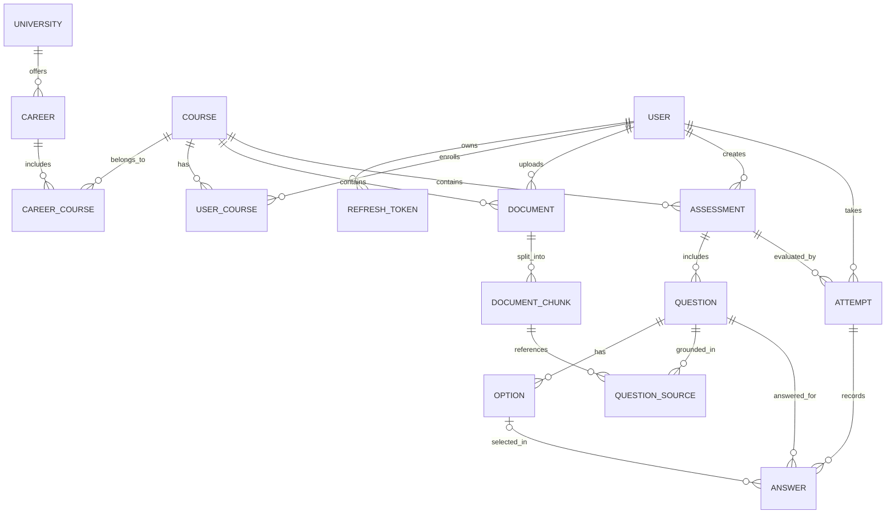

# ExamForge: Generador Inteligente de Evaluaciones Académicas mediante RAG

## Portada

- **Título del Proyecto:** ExamForge - Plataforma Backend para la Generación, Gestión y Resolución de Evaluaciones Académicas Contextualizadas mediante Arquitectura RAG
- **Curso:** CS 2031 Desarrollo Basado en Plataforma
- **Periodo Académico:** 2026-2
- **Integrantes del Equipo:**
  - Lucia Rodriguez — Código: 202310459
  - Samira Rincon — Código: 202220436
  - Valeria Briceño — Código: 202310513
- **Enlace de Despliegue en Producción:** [AQUÍ VA LA URL DE AWS] *(Nota: Desplegado usando AWS Academy Learner Lab)*
- **Colección Postman:** [`postman_collection.json`](./postman_collection.json) en la raíz del repositorio

## Índice

1. [Introducción](#introducción)
2. [Identificación del Problema o Necesidad](#identificación-del-problema-o-necesidad)
3. [Descripción de la Solución](#descripción-de-la-solución)
4. [Modelo de Entidades](#modelo-de-entidades)
5. [Manejo de Errores](#manejo-de-errores)
6. [Medidas de Seguridad Implementadas](#medidas-de-seguridad-implementadas)
7. [Eventos y Asincronía](#eventos-y-asincronía)
8. [GitHub & Management](#github--management)
9. [Instalación y Ejecución Local](#instalación-y-ejecución-local)
10. [Conclusión](#conclusión)
11. [Apéndices](#apéndices)

## Introducción

### Contexto

El material universitario (diapositivas, lecturas y guías en PDF) suele estar disperso. Los modelos de lenguaje (LLMs) pueden generar preguntas, pero no las vinculan con una jerarquía académica (universidad, carrera, curso) ni indican de qué documento provienen. ExamForge centraliza este material y genera evaluaciones mediante **generación aumentada por recuperación** (RAG, *Retrieval-Augmented Generation*).

### Objetivos del Proyecto

- Construir una API REST modular con Spring Boot para la jerarquía curricular y el ciclo completo de los exámenes.
- Procesar PDFs de forma asíncrona: fragmentación (*chunking*) y embeddings vectoriales.
- Implementar seguridad sin estado con JWT y roles (RBAC).
- Garantizar trazabilidad entre cada pregunta y los fragmentos que la sustentan.

## Identificación del Problema o Necesidad

### Descripción del Problema

- **Falta de trazabilidad:** la IA generalista produce preguntas plausibles pero sin citar el texto ni la página de origen.
- **Desorganización curricular:** ningún modelo vincula las evaluaciones con la malla (universidad, carrera, curso).
- **Sin motor de práctica:** no se registran las respuestas por intento, por lo que no se mide el desempeño por tema.

### Justificación

Anclar la generación al material del curso hace la práctica fiel a la bibliografía, ahorra tiempo al docente y da al estudiante retroalimentación inmediata sobre sus puntos débiles.

## Descripción de la Solución

### Funcionalidades Implementadas

- **Identidad y sesión:** registro, cifrado de credenciales con BCrypt, tokens de acceso JWT y refresh tokens persistidos y revocables.
- **Estructura académica:** gestión de universidades, carreras, cursos y matrículas.
- **Ingesta y vectorización:** subida de PDFs, fragmentación en *chunks* y cálculo de embeddings almacenados en pgvector.
- **Generación RAG:** recuperación de contexto por similitud coseno y síntesis de preguntas con explicación y cita de la fuente.
- **Editor de evaluaciones:** edición manual y regeneración individual de una pregunta sin regenerar el examen completo.
- **Motor de resolución:** registro de cada respuesta (`Answer`), calificación automática y desempeño por tema.
- **Procesamiento asíncrono:** ingesta, generación y envío de correos en segundo plano.

### Tecnologías Utilizadas

| Área | Tecnología |
|---|---|
| Lenguaje | Java 21 LTS |
| Framework | Spring Boot 3.3.5 (Web, Data JPA, Security, Mail, Validation) |
| Base de datos | PostgreSQL 16 + pgvector |
| IA y embeddings | API de LLM (OpenAI / Gemini) y modelos de embeddings |
| Seguridad | Spring Security 6, JJWT, BCrypt |
| Documentos | Apache PDFBox |
| Mapeo | MapStruct y Lombok |
| Correo | JavaMailSender + Thymeleaf |
| Documentación API | springdoc-openapi (Swagger UI) |
| Build y entorno | Maven, Docker Compose |

## Modelo de Entidades

### Diagrama Entidad-Relación



### Descripción de Entidades, Atributos y Relaciones JPA

El modelo comprende **15 entidades**:

1. **University** (`universities`): id, name, acronym. `@OneToMany` hacia Career.
2. **Career** (`careers`): id, name, code. `@ManyToOne` hacia University; `@OneToMany` hacia CareerCourse.
3. **Course** (`courses`): id, name, code, description. `@OneToMany` hacia CareerCourse, UserCourse, Document y Assessment.
4. **CareerCourse** (`career_courses`): enlace entre carreras y cursos, con restricción única (career, course). `@ManyToOne` hacia Career y Course.
5. **User** (`users`): id, fullName, email (único), password, role, createdAt. `@OneToMany` hacia UserCourse, Attempt y RefreshToken.
6. **RefreshToken** (`refresh_tokens`): id, token (único), expiryDate, revoked. `@ManyToOne` hacia User.
7. **UserCourse** (`user_courses`): id, roleInCourse, enrolledAt, con restricción única (user, course). `@ManyToOne` hacia User y Course.
8. **Document** (`documents`): id, title, fileUrl, fileSize, status (`PENDING`, `PROCESSING`, `READY`, `FAILED`). `@ManyToOne` hacia Course y User; `@OneToMany` hacia DocumentChunk.
9. **DocumentChunk** (`document_chunks`): id, content, pageNumber, chunkOrder, embedding (tipo `vector`). `@ManyToOne` hacia Document.
10. **QuestionSource** (`question_sources`): id, relevanceScore, excerptCited. Registra qué fragmento sustenta cada pregunta. `@ManyToOne` hacia Question y DocumentChunk.
11. **Assessment** (`assessments`): id, title, description, difficulty, visibility, status (`DRAFT`, `GENERATING`, `READY`, `PUBLISHED`, `FAILED`). `@ManyToOne` hacia Course y User; `@OneToMany` hacia Question.
12. **Question** (`questions`): id, text, type (`MULTIPLE_CHOICE`, `TRUE_FALSE`), topic, explanation. `@ManyToOne` hacia Assessment; `@OneToMany` hacia Option y QuestionSource.
13. **Option** (`options`): id, text, isCorrect. `@ManyToOne` hacia Question.
14. **Attempt** (`attempts`): id, score, startedAt, completedAt, feedback. `@ManyToOne` hacia Assessment y User; `@OneToMany` hacia Answer.
15. **Answer** (`answers`): id, isCorrect. `@ManyToOne` hacia Attempt, Question y Option (opción marcada).

**Optimización:** las relaciones `@ManyToOne` usan `FetchType.LAZY`; `cascade = ALL` con `orphanRemoval` solo en composición (Assessment → Question → Option, Attempt → Answer, Document → DocumentChunk). Los intentos no se borran en cascada, para conservar el historial.

## Manejo de Errores

### Estrategia de Excepciones Globales

Un `@RestControllerAdvice` centraliza el manejo de errores y responde siempre con `ErrorResponseDTO`:

- `timestamp`: fecha y hora en formato ISO-8601.
- `status`: código HTTP.
- `error`: nombre estándar del estado HTTP.
- `message`: motivo del fallo.
- `path`: URI invocada.

Manejarlas globalmente evita exponer trazas internas y garantiza un formato y código HTTP uniformes.

### Catálogo de Excepciones Personalizadas

Todas heredan de una clase abstracta común `ApiException extends RuntimeException`:

```
ApiException (abstracta)
├── ResourceNotFoundException          (404)
├── BadRequestException                (400)
├── UnauthorizedException              (401)
├── InvalidTokenException              (401)
├── ForbiddenException                 (403)
├── DuplicateResourceException         (409)
├── AttemptAlreadySubmittedException   (409)
├── DocumentProcessingException        (422)
├── FileStorageException               (500)
└── AiGenerationException              (502)
```

También se manejan excepciones de Spring: `MethodArgumentNotValidException` (400, con el detalle de errores por campo), `HttpMessageNotReadableException` (400), `AccessDeniedException` (403) y un manejador genérico para errores no controlados (500).

## Medidas de Seguridad Implementadas

### Seguridad de Datos y Arquitectura JWT

- **Firma:** tokens de acceso firmados con HMAC-SHA256 (HS256); la clave secreta se lee de variables de entorno.
- **Filtro:** `JwtAuthenticationFilter` extrae el token del encabezado `Authorization: Bearer <token>`, valida firma y expiración, y registra la autenticación en el `SecurityContextHolder`.
- **Contraseñas:** `BCryptPasswordEncoder` con factor de costo 12 y *salt* por usuario.
- **Sesión:** refresh tokens persistidos en base de datos, con renovación y revocación explícita en el logout.

### Control de Acceso Basado en Roles (RBAC)

Tres roles almacenados en base de datos e incluidos en el JWT:

- **STUDENT:** sube su material, genera, edita y resuelve sus propias evaluaciones.
- **TEACHER:** además publica evaluaciones oficiales dentro de sus cursos.
- **ADMIN:** gestiona universidades, carreras, cursos y usuarios.

Se aplica con `@EnableMethodSecurity` y `@PreAuthorize`. Además, los servicios verifican que el usuario autenticado sea dueño del recurso antes de editarlo o eliminarlo.

### Prevención de Vulnerabilidades Comunes

- **Inyección SQL:** consultas Spring Data JPA y JPQL parametrizadas; la búsqueda vectorial nativa de pgvector usa parámetros enlazados, sin concatenación.
- **XSS:** la API responde exclusivamente JSON y nunca renderiza HTML con datos del usuario; Bean Validation (`@NotBlank`, `@Size`, `@Pattern`) restringe formato y longitud de las entradas.
- **CSRF:** deshabilitado de forma justificada, ya que la autenticación usa tokens en encabezados y no cookies de sesión.
- **CORS:** `CorsConfigurationSource` con orígenes, métodos y cabeceras explícitos.
- **Secretos:** credenciales y claves solo en variables de entorno; `.env` excluido del repositorio.

## Eventos y Asincronía

Las operaciones lentas se ejecutan fuera del hilo de la petición mediante eventos publicados con `ApplicationEventPublisher` y consumidos por listeners `@TransactionalEventListener` + `@Async` sobre un `ThreadPoolTaskExecutor`. Así la API responde de inmediato.

| Evento | Acción asíncrona | Por qué es asíncrono |
|---|---|---|
| `DocumentUploadedEvent` | Extrae texto con PDFBox, genera chunks y embeddings, y cambia el estado a `READY` | Procesar un PDF y llamar a la API de IA puede tardar varios segundos |
| `AssessmentGenerationRequestedEvent` | Recupera fragmentos relevantes y genera las preguntas con el LLM | La generación depende de un servicio externo lento |
| `AssessmentGeneratedEvent` | Notifica por correo que la evaluación está lista | El envío SMTP no debe bloquear la generación |
| `UserRegisteredEvent` | Envía el correo de bienvenida | El registro responde sin esperar al servidor de correo |
| `AttemptCompletedEvent` | Envía el reporte de resultados con desempeño por tema | La calificación se entrega de inmediato; el correo se envía después |

Los endpoints de subida y generación responden `202 Accepted`; el cliente consulta el `status` del recurso. Los correos usan plantillas Thymeleaf.

## GitHub & Management

### Gestión de Tareas y Flujo Git

- **Ramas:** `main` (versión estable) y `develop` (integración); ramas de trabajo `feature/`, `fix/`, `chore/` y `docs/` creadas desde `develop`.
- **Protección:** un ruleset impide commits directos a `main` y `develop`; cada Pull Request requiere una aprobación de otra integrante y la resolución de los comentarios.
- **Commits:** convención Conventional Commits (`feat:`, `fix:`, `chore:`, `docs:`).
- **Seguimiento:** GitHub Projects con tablero Kanban; cada Issue se asigna a una integrante y se cierra desde su Pull Request.

### Integración Continua con GitHub Actions

El workflow `.github/workflows/backend-ci.yml` se ejecuta en cada Pull Request hacia `develop` y `main`: prepara JDK 21 (Temurin), usa caché de dependencias Maven y ejecuta `./mvnw verify`. Un PR que no compila o cuyas pruebas fallan no puede integrarse.

## Instalación y Ejecución Local

**Requisitos:** JDK 21, Docker y Git.

```bash
git clone https://github.com/Saamiira/examforge-backend.git
cd examforge-backend
cp .env.example .env          # completar los valores
docker compose up -d          # PostgreSQL 16 + pgvector
./mvnw spring-boot:run
```

- API: `http://localhost:8080/api/v1`
- Swagger UI: `http://localhost:8080/swagger-ui.html`

| Variable | Descripción |
|---|---|
| `DB_HOST`, `DB_PORT`, `DB_NAME`, `DB_USER`, `DB_PASSWORD` | Conexión a PostgreSQL |
| `JWT_SECRET` | Clave de firma (generar con `openssl rand -base64 64`) |
| `JWT_EXPIRATION_MS`, `JWT_REFRESH_EXPIRATION_MS` | Vigencia de los tokens |
| `MAIL_HOST`, `MAIL_PORT`, `MAIL_USERNAME`, `MAIL_PASSWORD` | Servidor SMTP |
| `AI_API_KEY`, `AI_BASE_URL`, `AI_CHAT_MODEL`, `AI_EMBEDDING_MODEL` | Credenciales y configuración del proveedor de IA (Gemini) |
| `ADMIN_EMAIL`, `ADMIN_PASSWORD` | Credenciales del primer administrador |
| `UPLOAD_DIR` | Carpeta local para almacenar PDFs temporalmente |
| `CORS_ALLOWED_ORIGINS` | Orígenes permitidos del frontend |

### Endpoints principales (`/api/v1`)

| Módulo | Rutas |
|---|---|
| Auth | `POST /auth/register`, `POST /auth/login`, `POST /auth/refresh`, `POST /auth/logout` |
| Académico | `GET /universities`, `GET /careers`, `GET /courses`, `POST /courses`, `GET /courses/{id}/enrollments`, `POST /courses/{id}/enrollments` |
| Documentos | `POST /courses/{courseId}/documents`, `GET /courses/{courseId}/documents/{id}` |
| Evaluaciones | `GET /assessments/me`, `GET /courses/{courseId}/assessments`, `POST /assessments/generate`, `GET /assessments/{id}`, `PUT /assessments/{id}`, `DELETE /assessments/{id}`, `POST /assessments/{id}/publish` |
| Preguntas | `PUT /assessments/{id}/questions/{questionId}`, `DELETE /assessments/{id}/questions/{questionId}`, `GET /assessments/{id}/questions/{questionId}/sources` |
| Intentos | `POST /assessments/{id}/attempts`, `POST /attempts/{id}/submit`, `GET /attempts/{id}` |

El detalle completo con ejemplos está en Swagger y en la colección Postman.

### Cómo probar (Flujo completo)

1. **Login como Admin:** `POST /auth/login` para obtener el token.
2. **Crear Curso:** `POST /courses` para crear un espacio de trabajo.
3. **Subir PDF:** `POST /courses/{courseId}/documents` para cargar el material de estudio.
4. **Esperar READY:** Consultar `GET /courses/{courseId}/documents/{id}` hasta que el estado del documento sea `READY`.
5. **Generar Evaluación:** `POST /assessments/generate` seleccionando el PDF subido.
6. **Publicar:** `POST /assessments/{id}/publish` para hacerla visible.
7. **Rendir y Calificar:** Un estudiante inicia (`POST /assessments/{id}/attempts`), envía sus respuestas (`POST /attempts/{id}/submit`) y obtiene su nota (`GET /attempts/{id}`).

## Conclusión

### Logros del Proyecto

Un backend que conecta el material de cada curso con la generación de evaluaciones: documentos procesados en segundo plano, preguntas con su fuente citada e intentos calificados automáticamente, sobre una API segura con JWT y roles.

### Aprendizajes Clave

- Diseñar un pipeline RAG con trazabilidad fuente-pregunta.
- Desacoplar procesos lentos con eventos y asincronía.
- Validar y reintentar respuestas del LLM con formato inesperado.
- Colaborar con ramas protegidas, Pull Requests y code review.

### Trabajo Futuro

- Preguntas de respuesta corta con corrección asistida por IA.
- Colecciones, favoritos, comentarios y *fork* de evaluaciones de la comunidad.
- Migraciones versionadas con Flyway y almacenamiento de archivos en Amazon S3.
- Integración con el frontend web y móvil.

## Apéndices

### Licencia

Distribuido bajo la licencia MIT. Ver [LICENSE](./LICENSE).

### Referencias

- Lewis, P. et al. (2020). *Retrieval-Augmented Generation for Knowledge-Intensive NLP Tasks*. NeurIPS.
- Spring Boot Reference Documentation — https://docs.spring.io/spring-boot/
- Spring Security Reference — https://docs.spring.io/spring-security/reference/
- pgvector — https://github.com/pgvector/pgvector
- JJWT — https://github.com/jwtk/jjwt
- OWASP Top 10 — https://owasp.org/www-project-top-ten/
